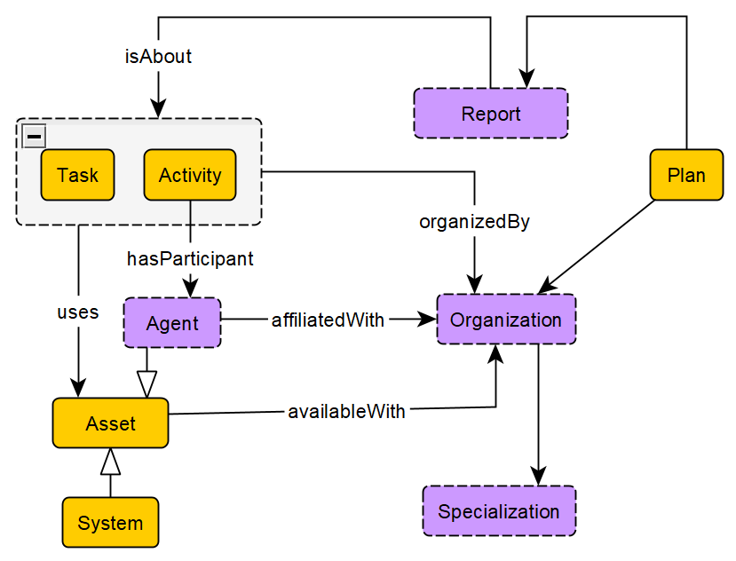
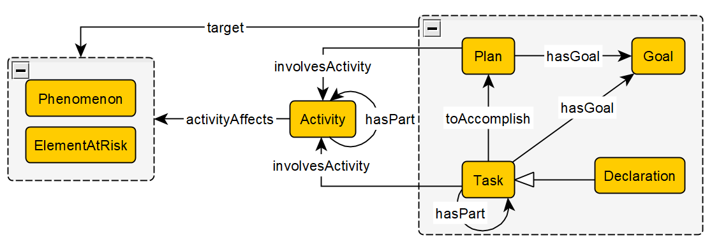

# Disaster Management Domain Ontology (DMDO)
The Disaster Management Domain Ontology (DMDO) provides a semantic framework to align and connect various datasets on hazards and disasters contained within the [KnowWhereGraph](https://knowwheregraph.org/), a densely linked knowledge graph that integrates over 30 environmental and social datasets. 

DMDO offers: 
- a consistent knowledge pattern that can be used to query across all hazard datasets (e.g., on droughts, hurricanes and wildfires) in a uniform manner; 
- alignment of named events (e.g., *Hurricane Katrina*) across different datasets (e.g., NOAA Storm Events, FEMA Disaster Declarations Summaries, NOAA Historical Hurricane Tracks);
- methods to use or integrate data with authoritative classification schemas and vocabularies; and
- representation of causal relations between events and/or impacts and effects on people, places and public health.

DMDO consists of two modules: the [Hazard Module](#hazard-module), which conceptualizes and organizes observational data pertaining to different types of hazards, largely by  re-using the [SOSA Ontology](https://www.w3.org/2015/spatial/wiki/SOSA_Ontology); and the [Operational Module](#operational-module), which provides a pattern for operational effectiveness before, during and after an emergency.  

## Hazard Module --> Note that in the paper, this is variously called the "Disaster Phenomenon" and "Hazard Phenomenon" module--which label is best??

**NEEDS CONTENT**

## Operational Module
The Operational Module focuses on the **functional** and **processual** aspects of disaster management. 

**Functional aspects** may include the design, operation or improvement of systems and processes, for example, strengthening levee systems to prevent or reduce the severity of disasters. Functional aspects may also include the coordination, regulation and monitoring of relief and recovery assistance.

**Processual aspects** are more activity oriented, taking one or more kinds of inputs (people or resources) to create outputs (or outcomes) that are of value in a given situation. Examples include mobilizing relief supplies, evacuating people, helping humanitarian responders to rapidly access to disaster victims for humanitarian responders, facilitate the timely flow of relief goods.

## Contributors
TO ADD
## Publications
1. Stephen, S., Shimizu, C., Schildhauer, M., Zhu, R., Janowicz, K., and Hitzler, Pascal. "A Pattern for Representing Scientific Taxonomies." WOP@ ISWC (2022).
