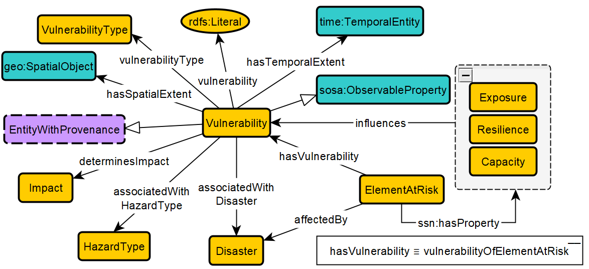
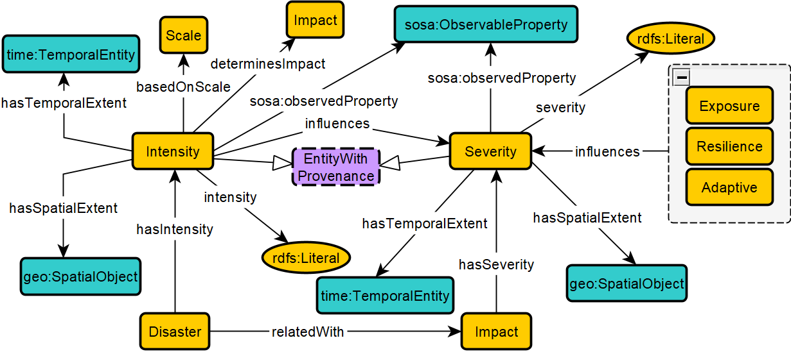

# The Disaster Risk Properties Ontology (modeling risk properties)

## Generalized Schema Diagram: Hazard Meets Disaster

 |  | 
|:--:| 
| Fig. 1- *Schema showing the interrelationships between Hazard, Disaster, Impact, and ElementAtRisk in the Disaster Management Domain Ontology. Yellow boxes are classes. Edges are object properties. The edge extending from the grey box with a dashed border is common to the two grouped classes.* |

## Vulnerability

 |  | 
|:--:| 
| Fig. 2- *Schema diagram for the Vulnerability class and its semantic connections. Yellow boxes are classes; blue boxes are classes from external standard ontologies, purple boxes are also external classes but acknowledge external dependency (i.e., they are left unmodeled in DPO); and edges with filled arrows are object properties.* |

## Intensity and Severity

 |  | 
|:--:| 
| Fig. 3- *Schema diagram for the Intensity and Severity classes and their semantic connections.* |

## Exposure

 |  | 
|:--:| 
| Fig. 4- *Schema diagram for the Exposure class and its semantic connections.* |

## Capacity and Resilience

 |  | 
|:--:| 
| Fig. 5- *Schema diagram for the Capacity and Resilience classes and their semantic connections.* |

## Disaster Risk

 |  | 
|:--:| 
| Fig. 6- *Schema diagram for the Capacity and Resilience classes and their semantic connections.* |

