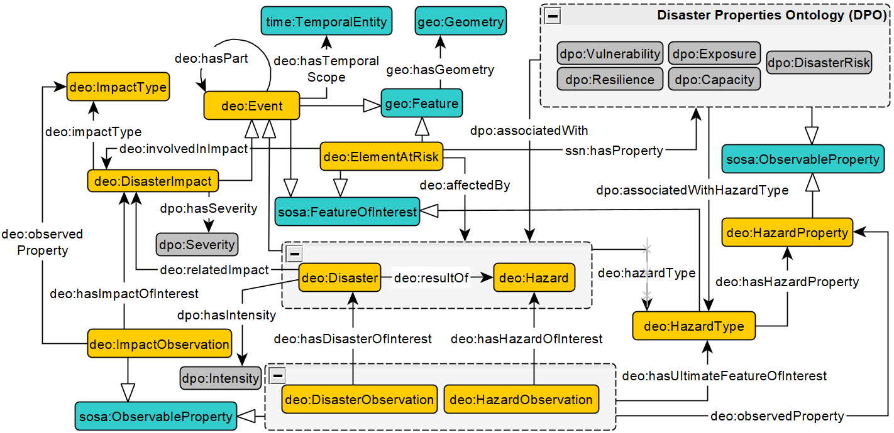

# The Hazard Event Ontology (HEO)

## Generalized Schema Diagram

|  | 
|:--:| 
| Fig. 1- *Schema showing the interrelationships between Hazard, Disaster, Impact, and ElementAtRisk in the Hazard Event Ontology. Yellow boxes are classes in HEO. Blue boxes are classes from external standard ontologies. Grey boxes are classes from the Disaster Properties Ontology (DPO). Edges are object properties. The edge extending from the grey box with a dashed border is common to the grouped classes.* |

|  | 
|:--:| 
| Fig. 1- *Schema showing the interrelationships between Hazard, Disaster, Impact, and ElementAtRisk in the Hazard Event Ontology. Yellow boxes are classes in HEO. Blue boxes are classes from external standard ontologies. Grey boxes are classes from the Disaster Properties Ontology (DPO). Edges are object properties. The edge extending from the grey box with a dashed border is common to the grouped classes.* |
