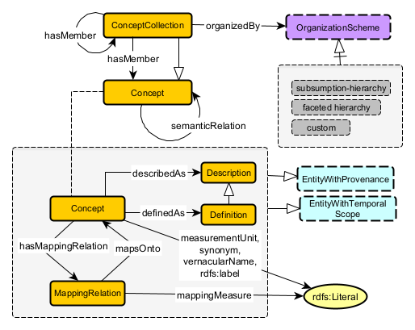
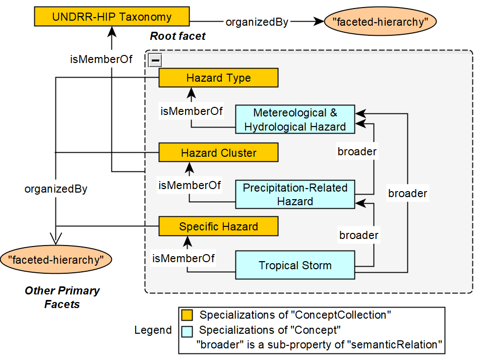

# Building Ontologies using Standardised Taxonomies
## Scientific Taxonomy Pattern
TO ADD

### Schema Diagrams
TO ADD - Description of core classes

Overview Schema Diagram of the Scientific Taxonomy Pattern

Representing a Subset of the UNDRR HIP Classification using STP

